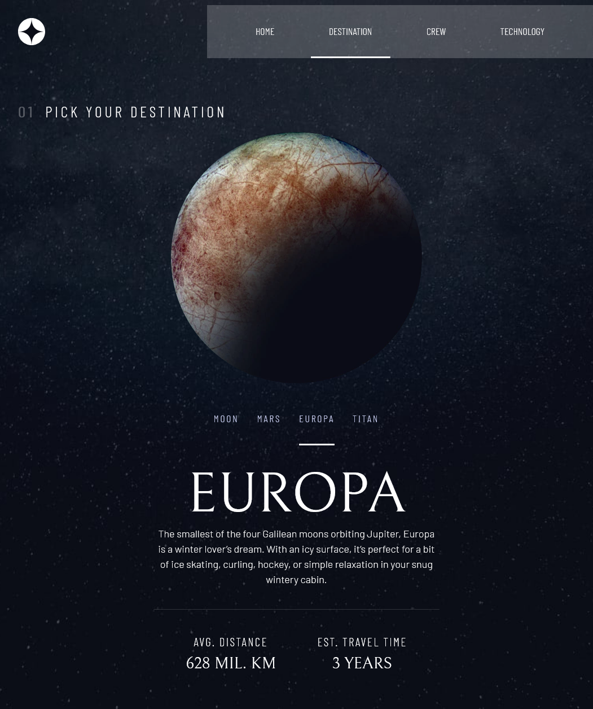

# Frontend Mentor - Space tourism website solution

This is a solution to the [Space tourism website challenge on Frontend Mentor](https://www.frontendmentor.io/challenges/space-tourism-multipage-website-gRWj1URZ3). Frontend Mentor challenges help you improve your coding skills by building realistic projects.

## Table of contents

- [Overview](#overview)
  - [The challenge](#the-challenge)
  - [Screenshot](#screenshot)
  - [Links](#links)
- [My process](#my-process)
  - [Built with](#built-with)
  - [What I learned](#what-i-learned)
  - [Continued development](#continued-development)
  - [Useful resources](#useful-resources)
- [Author](#author)

**Note: Delete this note and update the table of contents based on what sections you keep.**

## Overview

### The challenge

Users should be able to:

- View the optimal layout for each of the website's pages depending on their device's screen size
- See hover states for all interactive elements on the page
- View each page and be able to toggle between the tabs to see new information

### Screenshot

**Note: Delete this note and the paragraphs above when you add your screenshot. If you prefer not to add a screenshot, feel free to remove this entire section.**

### Links

- Solution URL: [Add solution URL here](https://your-solution-url.com)
- Live Site URL: [Add live site URL here](https://your-live-site-url.com)

## My process

### Built with

- Semantic HTML5 markup
- CSS custom properties
- Flexbox
- CSS Grid
- Mobile-first workflow
- vanilla JS

**Note: These are just examples. Delete this note and replace the list above with your own choices**

### What I learned

I learned Im a total noob still with css and JS, I still have a lot to learn, and I should keep going its hard, but hard thing have their prises.

I also learned to use some css properties in a new way like widths and positions.

15-01-2022
Learned how to use grid template areas properly, learned how to make the website more interactive with JS.

### Continued development

I really want to be a Pro in JS, I use it so little in this project, I was viewing some websites that had crazy amount of JS, I at least want to understand and decode that.

I had to learn some more about responsive layouts and some css properpeties, and how to google things properly when im lost, I use to code in python and googling things there seemed a lot easier or just I just lost the ability, anyways I should get better at it.

15-02-2022
I added more JS, and learned a lot, but offcourse I still need a lot more practice.

**Note: Delete this note and the content within this section and replace with your own plans for continued development.**

### Useful resources

- [Kevin Poweell](https://www.youtube.com/watch?v=HbBMp6yUXO0&t=893s) - This helped me create the navbar, I have a lot more understanding on creating navbars now.

**Note: Delete this note and replace the list above with resources that helped you during the challenge. These could come in handy for anyone viewing your solution or for yourself when you look back on this project in the future.**

## Author

- Website - [david cen](davidcen.nft)
- Twitter - [@davidcentz](https://twitter.com/Davidcentz)

**Note: Delete this note and add/remove/edit lines above based on what links you'd like to share.**

**Note: Delete this note and edit this section's content as necessary. If you completed this challenge by yourself, feel free to delete this section entirely.**
